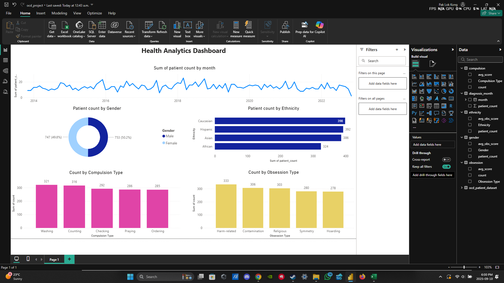

# 🧠 OCD Health Analytics — SQL + Power BI (Concise)

A compact portfolio project that takes a de-identified OCD patient dataset through **SQL exploration/cleaning** and a **Power BI dashboard**. I **skipped the Excel/Power Query dashboard duplication** to avoid repetition—Power BI is the primary front-end.

---

## 🔍 Overview
- **Goal:** profile patients and symptoms, quantify **severity (Y-BOCS)**, and surface **cohort insights** by gender/ethnicity/obsession–compulsion types.
- **Stack:** SQL (analysis queries), Power BI (model + visuals).  
- **Status:** finished; refreshable report with light, clean measures.

---
## 📸 Dashboard Screenshot

---
## 📦 Data (summary)
- **Rows:** 1,500  |  **Columns:** 17  
- **Demographics:** Age 18–75 (mean ≈ 46.8), Gender ~(50/50), 4 ethnic groups.  
- **Symptoms:** 5 obsession types, 5 compulsion types.  
- **Severity:** mean **Y-BOCS** ≈ **20.1** (Obsessions), **19.6** (Compulsions).

**Top categories (count):**
- Obsessions: **Harm-related (333)**, **Contamination (306)**, **Religious (303)**
- Compulsions: **Washing (321)**, **Counting (316)**, **Checking (292)**

---

## 🗂️ Repo / Files
- `/ocd_patient_dataset.csv` — de-identified input data  
- `/ocd.sql` — SQL queries (gender split & averages, ethnicity breakdown, age bands, obsession/compulsion distributions)  
- `/ocd_project.pbix` — Power BI model + visuals (Overview, Cohorts, Demographics)

---

## 📊 KPIs & Questions (in the PBIX)
- Patient count, gender & ethnicity mix  
- Avg **Y-BOCS** (Obsessions/Compulsions) overall and by cohort  
- Distribution of **obsession** / **compulsion** types  
- Age profile (bands), simple cohort comparisons

---

## 🧩 Example Findings 
- **Gender split** is balanced (F **747** / M **753**) with similar avg Y-BOCS (Obs: F **20.2**, M **19.9**).  
- **Harm-related** and **Contamination** dominate obsession categories; **Washing** and **Counting** lead compulsion types.  
- Age is centered around the late-40s (median ≈ **47**).

---

